# 💰 PrestamosYA

Plataforma bimonetaria (BOB/USD) para gestión de micro-préstamos y cobranza de campo en Bolivia.

## Repositorios
- 📱 [prestamosya-mobile](https://github.com/marquezQ/prestamosya-mobile): app en React Native + Expo
- ⚙️ [prestamosya-api](https://github.com/marquezQ/prestamosya-api): API REST en NestJS + Prisma + PostgreSQL

## Qué hace
- Emisión de préstamos con simulador y planes de cuotas automáticos o manuales
- Cobro diario con imputación FIFO y anulación segura de pagos
- Clientes con GPS en mapa (OpenStreetMap) y apertura en WhatsApp / Google Maps
- Garantías con fotos optimizadas (Cloudinary + WebP)
- Cron de mora a las 6:00 AM y push con resumen de cobros a las 8:00 AM
- Dashboard de capital en calle y reportes mensuales en PDF

## Stack
NestJS 11 · Prisma 7 · PostgreSQL 16 · Expo SDK 54 · NativeWind · TanStack Query · Firebase FCM

## Detalle técnico
La arquitectura y las reglas de negocio están documentadas en el README de cada repositorio.

## 📱 Capturas de la Aplicación

<table>
  <tr>
    <td align="center" width="33%">
      <b>1. Inicio 1</b>  
      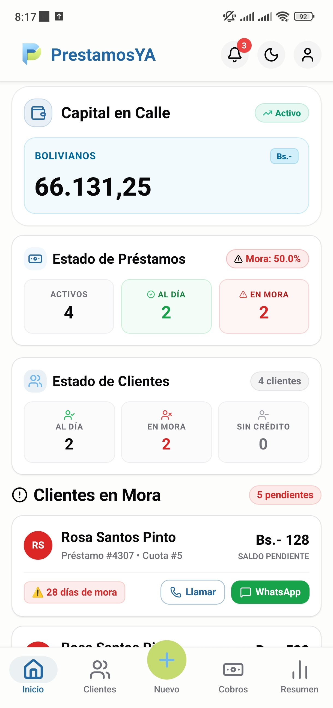
    </td>
    <td align="center" width="33%">
      <b>2. Inicio 2</b>  
      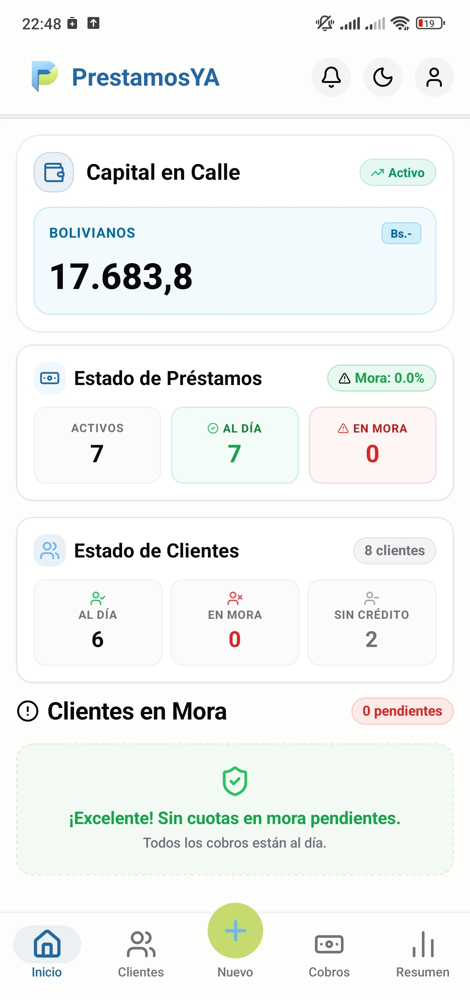
    </td>
    <td align="center" width="33%">
      <b>3. Clientes</b>  
      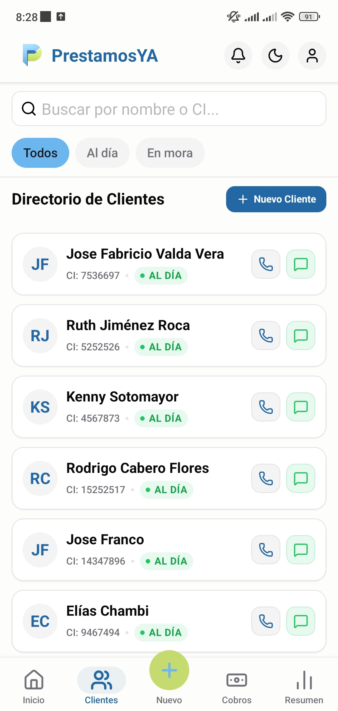
    </td>
  </tr>
  <tr>
    <td align="center">
      <b>4. Detalle Cliente</b>  
      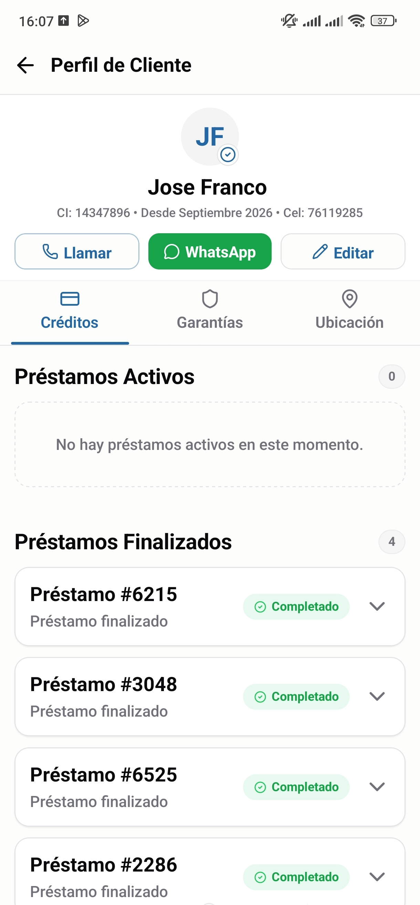
    </td>
    <td align="center">
      <b>5. Nuevo Préstamo</b>  
      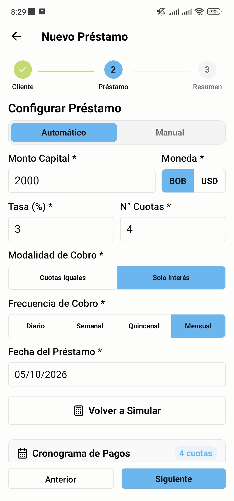
    </td>
    <td align="center">
      <b>6. Cronograma Préstamo</b>  
      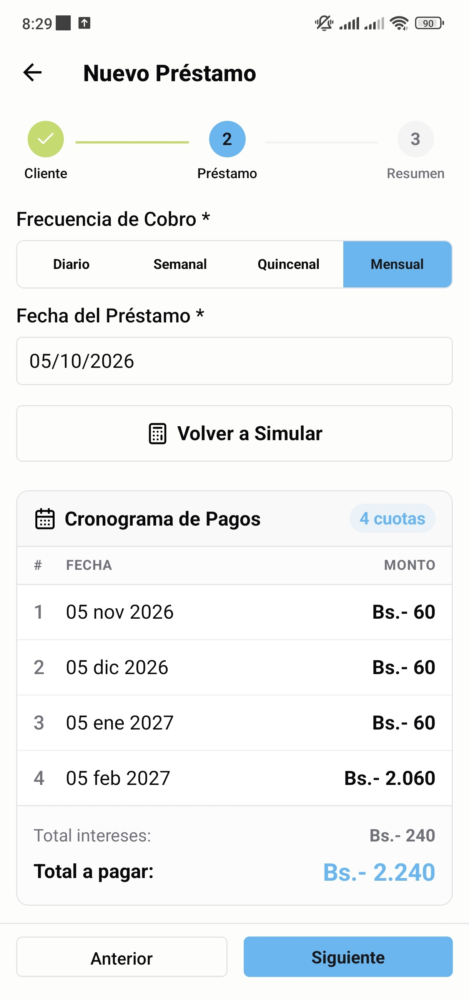
    </td>
  </tr>
  <tr>
    <td align="center">
      <b>7. Vista Cobros</b>  
      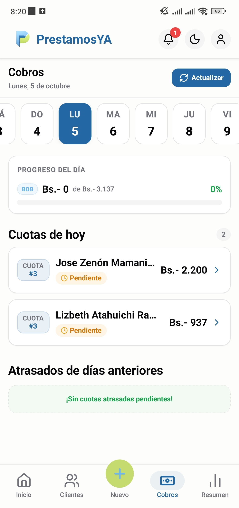
    </td>
    <td align="center">
      <b>8. Detalle de Préstamo</b>  
      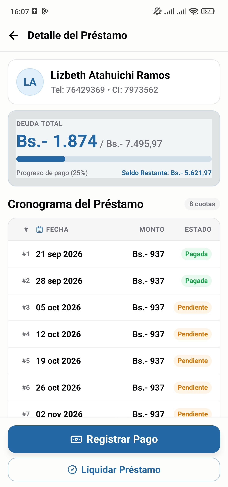
    </td>
    <td align="center">
      <b>9. Registrar Pago</b>  
      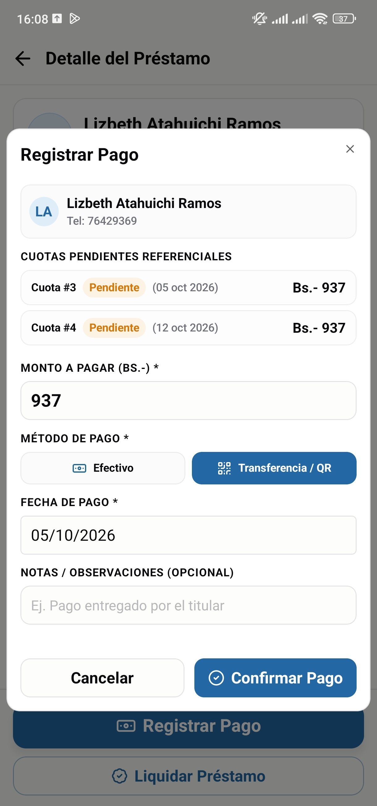
    </td>
  </tr>
  <tr>
    <td align="center">
      <b>10. Vista Resumen</b>  
      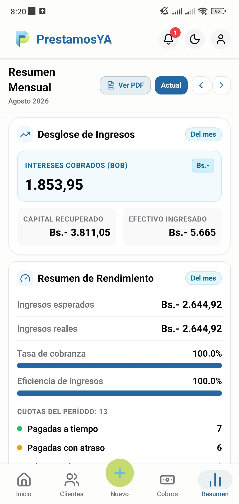
    </td>
    <td align="center">
      <b>11. Vista Resumen 2</b>  
      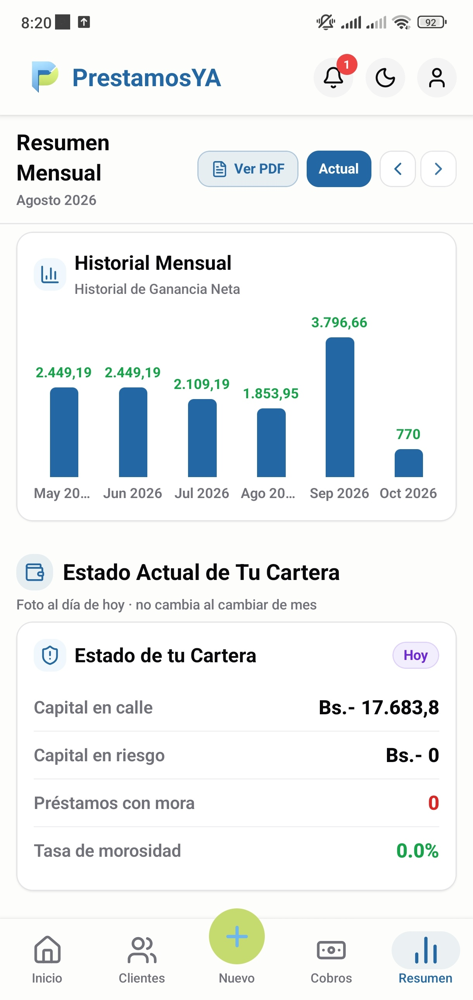
    </td>
    <td align="center">
      <b>12. Notificación Push</b>  
      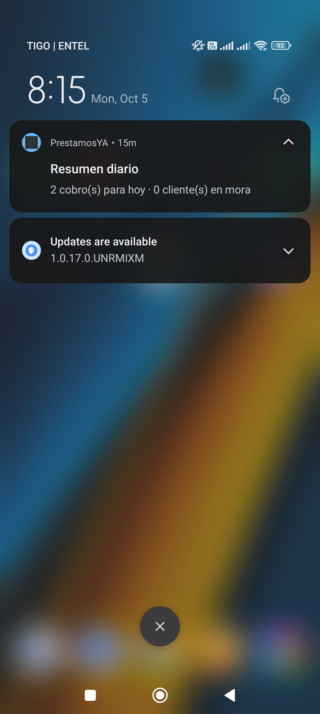
    </td>
  </tr>
</table>

